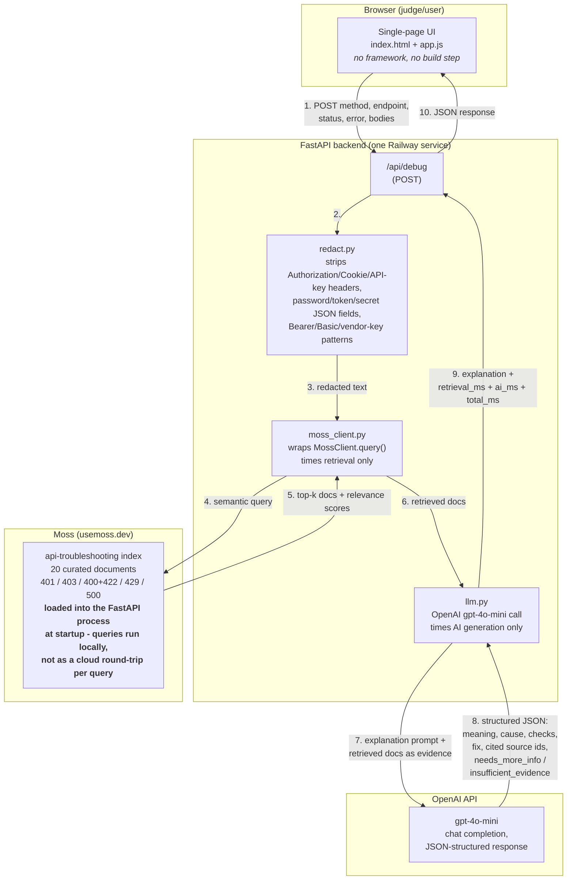

# ReqBro Assist — Architecture

## System diagram

## Where data is stored

**Nowhere, on ReqBro Assist's own infrastructure.** The backend has no
database and no logging of submitted content (the only server-side log
line is a startup-failure warning containing an SDK error message, never
user input — see `app/main.py`). Each request is processed in memory and
discarded once the response is returned.

Redacted request/response text *is* sent onward to two third parties as
part of generating the result, and is subject to their own policies:

- **Moss** — receives the redacted query text to run semantic search.
  Their retention policy for query text was not confirmed as of this
  writing.
- **OpenAI** — receives the redacted request details and retrieved
  document text as the prompt. OpenAI's default API policy retains
  inputs/outputs up to 30 days for abuse monitoring (not for training),
  unless the account has Zero Data Retention enabled.

Sensitive data (`Authorization` headers, API keys, passwords, tokens,
`Bearer`/`Basic` scheme values, common vendor key prefixes) is stripped
**before** step 3 above — before anything reaches either third party.

## Why the index loads at server startup, not per-request

Moss's query model runs the actual vector search **locally, in-process**
against an index that has been loaded into memory — this is what makes
sub-millisecond-scale retrieval possible in principle (no network round
trip per query). This was confirmed directly against the installed SDK
(not assumed from docs): calling `query()` against an index that hasn't
been `load_index()`-ed first raises `Index 'api-troubleshooting' is not
loaded`. Accordingly, the FastAPI app calls `load_index()` once in a
`lifespan` startup hook (`app/main.py`), and the one-time
`scripts/seed_index.py` script is only responsible for *creating* and
populating the index, not for making it queryable by the running server
process.

## Component responsibilities

| File | Responsibility |
|---|---|
| `app/static/index.html`, `app.js`, `examples.js` | UI: form, example buttons, result rendering, loading/error states |
| `app/main.py` | HTTP layer: request validation, orchestrates redact → retrieve → explain, assembles timing, serves the static frontend |
| `app/redact.py` | Strips sensitive data from free-text input before it leaves the process |
| `app/moss_client.py` | Wraps the Moss SDK; isolates retrieval timing from the rest of the request |
| `app/llm.py` | Builds the explanation prompt, calls OpenAI, isolates AI timing, parses the structured JSON result |
| `app/models.py` | Request/response schemas (Pydantic) — also where input validation lives (blank endpoint/status rejected) |
| `app/data/docs.py` | The curated 20-document knowledge base, source of truth for what gets indexed |
| `scripts/seed_index.py` | One-time script to create/populate the Moss index from `docs.py` |

## Deployment topology

One deployable service (FastAPI, serving both the API and the static
frontend from the same origin) on Railway. No separate frontend hosting,
no CORS configuration needed, one URL for judges to visit.
