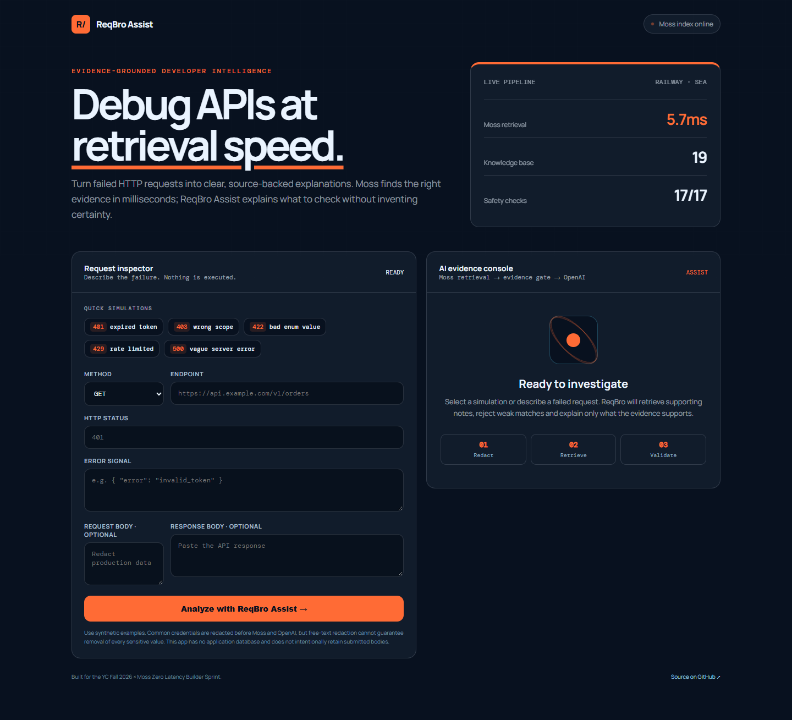

# ReqBro Assist — Submission Evidence

Prepared for the YC Fall 2026 × Moss Zero Latency Builder Sprint.

## Required links

- **Live agent:** https://reqbro-assist-production.up.railway.app
- **Public repository:** https://github.com/Madhuri-4596/reqbro-assist
- **Product requirements:** [PRD.md](PRD.md)
- **Architecture:** [ARCHITECTURE.md](ARCHITECTURE.md)
- **Architecture image:** [docs/architecture.svg](docs/architecture.svg)

## Verified production evidence

Verification date: **September 20, 2026**  
Hosting: **Railway, Southeast Asia**  
Knowledge base: **19 curated API troubleshooting documents**

### Health

`GET /api/health` returned HTTP `200` with:

```json
{"status":"ok"}
```

### End-to-end retrieval and explanation

A reproducible `GET https://api.github.com/user` failure was captured without
authentication. Its public `401 Requires authentication` response and the
observed missing Authorization header were sent to `/api/debug`. The live
response contained:

| Evidence | Result |
|---|---:|
| Moss sources returned | 5 |
| Trusted sources | 5 |
| Supporting sources cited | 1 |
| Moss retrieval | 14.0 ms |
| OpenAI generation | 3,613.9 ms |
| End-to-end | 3,628.2 ms |
| Application database retention | false |

This is one verified observation rather than an average or latency guarantee.
The captured response is public, and the test contained no credentials or
private production data.

## Safety evidence

- Sensitive values are redacted before Moss or OpenAI calls.
- The server never calls the endpoint supplied by the user.
- Retrieved text must exactly match the checked-in curated corpus before it can
  be passed to the model.
- A deterministic evidence gate requires an explicit matching signal.
- Model output is schema validated and citation IDs are checked.
- Missing, conflicting or unsupported evidence produces an abstention state.
- Suggested fixes are displayed for human review and never executed.
- The repository contains no real Moss or OpenAI credentials.

## Validation

The credential-free suite contains 17 tests covering redaction, strict input
validation, tampered retrieval content, sparse/no-match behavior, citations,
conflicting abstentions, malformed model output and sanitized provider errors.
The live provider check above is separate from that mocked regression suite.

## Screenshot



## Honest limitations

- The curated corpus covers a small set of common 400/401/403/422/429/500
  scenarios and is not universal API documentation.
- Pattern matching plus semantic retrieval does not prove root cause.
- Best-effort redaction cannot identify every sensitive value in arbitrary text.
- Moss, OpenAI and Railway have their own processing/logging policies.
- The observed timing is one production run, not a statistically meaningful
  benchmark.
