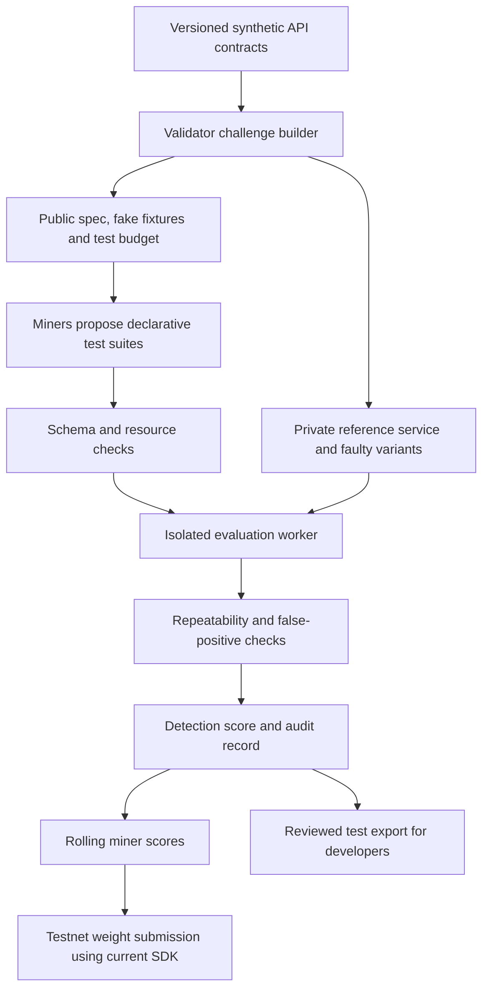

# ReqBro Subnet

## API regression tests rewarded by demonstrated bug detection

**Author:** Madhuri Gade  
**Stage:** Completed proposal for September 20 checkpoint; not submitted  
**Project name:** ReqBro Subnet — API regression tests rewarded by verified fault detection  
**Status:** Proposed design. No subnet, miner network, benchmark results or testnet deployment is claimed.

## 1. Summary

ReqBro Subnet would be a Bittensor subnet that produces reproducible API regression tests. Miners would turn an API contract into a compact test suite. Validators would run those tests against a correct reference service and hidden faulty variants, rewarding suites that detect real contract violations without flagging correct behavior.

The output would be an executable, inspectable test artifact with evidence of what it detected. Developers could review and export useful suites for their own CI workflows. The first prototype would focus on synthetic REST APIs and three failure families: access control, input boundaries and idempotency.

This proposal comes from my experience building full-stack applications and ReqBro, an API-testing app currently in Android testing. I also have professional blockchain experience at Persist Ventures, including Solana work and CarbonLaunchpad. ReqBro Subnet would be a new implementation; those projects are background experience, not evidence that this subnet already exists.

## 2. Problem, users and value

An endpoint can return a successful response while still violating its contract. A request might expose another user's resource, accept an invalid boundary value or create a duplicate operation when retried. Small engineering teams need tests for these behaviors, but generating many plausible-looking tests does not establish that the tests are useful.

ReqBro Subnet would focus its incentives on demonstrated failure detection. Its initial users would be API developers, QA engineers and teams building developer tools. A useful result would contain a request sequence, assertions, a short rationale and a validator report that makes the score reproducible.

The hypothesis is that competing miners using different generation strategies can discover complementary tests. That benefit must be measured against a single competent generator. If the network costs more to evaluate without improving detection or diversity, decentralization would not yet be justified. The prototype would report that tradeoff rather than assume a commercial market already exists.

## 3. Architecture and challenge flow

Validators would issue a versioned contract, fake accounts and seed records, allowed endpoint paths, a challenge identifier, a deadline and a request budget. The contract would specify expected behavior beyond the structural schema: who can access which resource, what counts as an invalid input, and how retries should behave.

Miners would return declarative JSON test suites. The validator's interpreter would execute a restricted set of request and assertion operations. The initial version would not accept arbitrary Python or JavaScript submitted by miners. Requests would only reach validator-owned fixture services, with no public internet egress.

Each evaluation would reset the data, replay the suite against the reference service and hidden faulty variants, and retain structured results. Private challenge material and future seeds would stay outside miner-visible responses. Sanitized records for retired challenges would support later audits.

## 4. Miner responsibilities

A miner would generate at most 12 tests and 40 total HTTP requests per submitted suite. These are proposed prototype limits, to be calibrated before a scored run. Each test would identify the contract rule, provide a request sequence, specify assertions and explain the intended failure condition.

For example, a contract might state that retrying the same valid operation with the same idempotency key returns the original result without creating another record. A miner could submit a two-request test followed by a count assertion. A validator could test this against a correct implementation and a variant that incorrectly creates two records.

Miners could use an LLM, property-based generation or handcrafted strategies. They would be evaluated on submitted behavior, not the model brand, explanation length or number of assertions. Credentials and records would be synthetic. Miners would not probe third-party systems.

## 5. Validator responsibilities and evaluation

Validators would maintain contracts, reference implementations and independently checked faulty variants. A variant would enter the benchmark only after a trusted oracle test establishes a specific violation. Ambiguous or behaviorally equivalent mutations would be excluded.

The first evaluation would have three stages:

1. **Admissibility:** validate the test schema, endpoint allowlist, assertion operations, request budget and deadline. Reject unsafe or malformed suites.
2. **Correctness and stability:** execute the suite against correct fixtures and replay it three times from clean state. A false alarm against correct behavior or inconsistent outcomes would make the suite ineligible for a positive score for that challenge.
3. **Useful detection:** evaluate eligible suites against a private, balanced set of faulty variants. A fault counts only when the miner's assertion detects the intended contract violation. Infrastructure errors would invalidate the affected evaluation and trigger a controlled retry; they would not count as discoveries.

Faults already caught by a published basic schema/status-code baseline would be excluded from the reward pool. Both baseline and miner results would remain in the report, making incremental value visible. The same difficulty distribution and resource budget would apply to competing miners.

## 6. Proposed scoring and reward logic

For each eligible suite:

- **D** is the mean detection fraction across the three fault families. Giving families equal weight prevents a large collection of easy variants from dominating.
- **B** is the fraction of families in which the suite detects at least one hidden fault.
- **S = 0.8 × D + 0.2 × B.** An ineligible suite receives S = 0.

For an illustrative calculation, detection rates of 0.50, 0.75 and 0.25 give D = 0.50 and B = 1.00, so S = 0.60. These numbers explain the formula; they are not measured results. Latency would be recorded and bounded, but would not earn a bonus that could reward fast, inaccurate answers.

Each miner would receive an equal target number of comparable challenges in a scoring window. We would average its challenge scores, then update a rolling quality score with an initial smoothing factor of 0.2. Missed assigned challenges would count as zero; validator outages would not penalize miners. New miners would receive scheduled evaluation opportunities rather than being excluded by a lack of history.

Positive rolling scores would be normalized into proposed validator weights. If all scores are zero, the implementation must follow the current chain's valid weight-update behavior without inventing evidence of quality. This design specifies the validator's intended weights, not a guaranteed payout: actual network rewards follow Bittensor's protocol. The coefficients and windows are hypotheses to test, not established optimal parameters.

## 7. Gaming risks and limits

Private randomized fixtures, rotating challenge families and held-out variants would make memorization less useful. Canonically identical tests within one submission would be deduplicated. Before the testnet milestone, a two-stage off-chain hash commitment and reveal protocol would be tested to limit copying after a submission is observed. This would not prevent collusion outside the protocol.

Multiple identities can still submit similar strategies. The proposal does not claim Sybil resistance from deduplication alone. We would examine score concentration and report duplicate behavior, then evaluate whether a later marginal-coverage mechanism is needed. It would not be introduced without testing how it affects honest miners.

Validators could disagree because of implementation mistakes or different challenge difficulty. Versioned interpreters, fixed resource budgets and reproducible replay would help detect this; two independently run validators would be part of the testnet goal. Hidden tests also create a transparency tradeoff, so retired challenge sets and sanitized scoring records would be published for auditing.

Finally, synthetic contracts do not establish real-world API reliability. Tests cannot cover behavior missing from the contract. Early exports would be recommendations for developer review, with no autonomous changes to a user's service.

## 8. Implementation roadmap and evidence

| Target | Intended result | Evidence to retain |
|---|---|---|
| September 19 | Submit the proposal checkpoint, ahead of the listed September 20 date | Submitted answers and receipt |
| September 21–27 | Build one contract fixture, test interpreter, baseline and scoring runner | Reproducible reference/faulty-service results |
| September 28–October 4 | Add all three fault families and two different miner strategies | Detection, false-positive, stability and runtime reports |
| October 5–11 | Integrate the current Bittensor SDK on testnet; aim for two validators and three miners | Miner-validator exchanges and actual testnet records |
| October 12–18 | Evaluate copying, missed responses, validator disagreements and held-out variants | Failure cases, limitations and reproducible demo |
| October 19 | Submit the final implementation package | Public repository, testnet evidence, video and pitch |

The proposed stack is Python for the interpreter and validator, a small owned fixture API, isolated Linux evaluation workers, and the current Bittensor SDK. SDK interfaces and testnet setup will be verified during implementation. No mainnet launch, token purchase or production deployment is assumed.

The first success criterion would be modest: demonstrate that a miner can catch a contract fault missed by the basic baseline, while passing the correct fixtures, and that another validator can reproduce the score. We would compare diversity, detection, false positives, evaluation time and resource cost against a single-generator baseline. Results would be published even if the subnet hypothesis performs poorly.

## 9. Submission notes and sources

This draft covers the September proposal checkpoint. The organizer separately requires implementation, repository and demo evidence for the final stage. The checkpoint is listed as September 20 without a precise time zone; the internal submission target above is deliberately earlier. [Official hackathon requirements and schedule](https://www.hackquest.io/hackathons/Bittensor-Global-Subnet-Hackathon)

Bittensor distinguishes miners producing useful outputs from validators assessing them; the network handles incentives. The API-specific mechanism and formula here are proposed choices, not official Bittensor recommendations. [Official Bittensor documentation](https://www.bittensor.com/docs)

The event lists Proven Testnet as an existing software-verification example. ReqBro Subnet is not claimed as the first verification subnet. Its proposed focus is declarative API contract tests and three bounded behavior families; the next design review should compare its value with existing subnets before implementation.

Submission readiness: the proposal content is complete. The live checkpoint form and its field limits still need inspection, and no submission receipt has been obtained. Dates below are implementation targets, not completed milestones.

## 10. Implementation boundary and first demonstrator

ReqBro is the existing Android API-testing application, currently in testing. ReqBro Assist is a separate debugging assistant with Moss retrieval and model-generated explanations; its reviewed code does not implement a Bittensor subnet. ReqBro Subnet is the proposed testing network described here. The existing projects provide product context, not testnet evidence. Moss and OpenAI are not mandatory dependencies for subnet scoring: the evaluator is deterministic, and a baseline miner can run without a paid model API.

The first demonstrator will use a synthetic order API with two fake users. Its public contract will define access boundaries, accepted quantity limits and idempotency behavior. The validator privately runs a correct service plus variants containing one independently verified fault each. A test suite must pass the correct service before it can earn credit for finding a faulty variant. Authentication tokens are disposable fixture values; no customer credentials or production endpoints enter this benchmark.

The submitted JSON will contain a challenge ID, protocol version and a bounded list of tests. Each test will include a contract rule ID, a sequence of allowed operations, bounded response-field captures and assertions. Assertions will be limited to equality, numeric comparisons, required fields and explicitly supported collection checks. No arbitrary expressions, shell commands, user-supplied URLs or dynamic code execution will be accepted. A collection-count assertion is permitted only where the public contract exposes an authorized listing operation.

A result bundle will contain the canonical suite hash, contract/interpreter versions, resource counts, reference-run results, repeatability checks, per-family detection counts and score. During an active scoring round, miners will receive only a receipt and delayed coarse feedback; private mutation identities and oracle outputs will not be disclosed. Full sanitized replay artifacts can be released after a challenge retires.

## 11. Score definition and edge cases

For family f, let n_f be the number of valid hidden faults not caught by the published basic baseline, and k_f the number reliably detected by the eligible suite. Define d_f = k_f / n_f. Every scored challenge must contain at least one eligible fault in each of the three families; otherwise rebuild or invalidate it rather than silently changing the denominator.

D = (d_access + d_boundary + d_idempotency) / 3
B = number of families with k_f > 0 / 3
S = 0.8 * D + 0.2 * B

Each distinct fault counts once, regardless of how many assertions detect it. Repeated or equivalent faulty variants must not inflate n_f. A fixed deadline and request budget bound computation; test ordering and worker capacity should be balanced across miners. Late/missing miner responses score zero, but validator or fixture failures trigger an invalid round/retry for every affected miner.

For the first scoring window, initialize each miner's rolling value to its mean valid assigned-challenge score. Subsequently use Q_new = 0.8 * Q_previous + 0.2 * window_mean. Only miners meeting the same minimum assignment count enter a weight-update comparison; new miners receive exploration assignments to reach that count. Normalize eligible positive Q values by their sum. The implementation must separately verify the chain's current weight constraints and all-zero behavior before submission. These local calculations do not promise token earnings.

The family-coverage bonus is deliberately modest but could still favor shallow coverage. Report both D and B separately and compare this rule with D-only scoring during evaluation. Change coefficients only between announced benchmark versions, never after observing a competitive round's results.

## 12. Acceptance criteria for the October prototype

- A miner submits a valid bounded suite and a validator rejects malformed, off-allowlist and over-budget suites.
- The suite passes all reference fixtures on three clean replays; failures earn no positive challenge score.
- At least one hidden contract fault missed by the basic baseline is detected reproducibly.
- Two independently operated validator processes reproduce results on the same retired challenge package; this is reproducibility evidence, not a claim of independent organizations.
- At least two miner strategies are compared under the same limits, including a non-LLM baseline.
- Actual testnet exchanges and weight-update evidence are recorded when available; local simulation is labeled as simulation.
- The final report includes failed experiments, cost/runtime observations, copying risks and synthetic-to-real-world limitations.

## 13. Short submission pitch

ReqBro Subnet turns API contracts into regression tests whose value is measured by the faults they actually detect. Miners generate bounded declarative test suites; validators replay them against correct reference services and hidden, independently verified faulty variants. Only stable suites that pass correct behavior earn a score, based on balanced detection across access-control, input-boundary and idempotency faults. The output is a developer-reviewable test artifact with reproducible evaluation evidence. The proposal builds on my experience creating ReqBro, an Android API-testing app currently in testing, while the subnet itself is a new proposed implementation. Our testnet goal is to demonstrate useful fault detection, fair miner evaluation and transparent limits before claiming production value.
